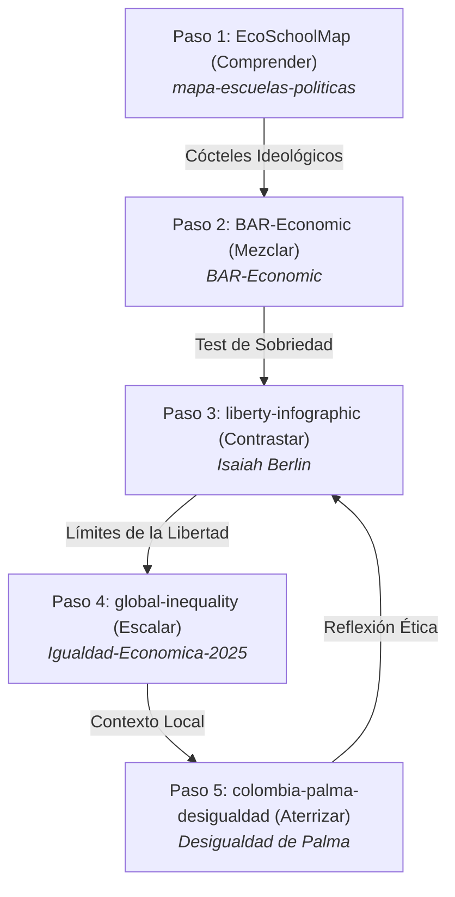

# 🍸 Elixires de la Razón: El Bar Económico · Paso 2

### *Experiencia digital interactiva y simulador cognitivo de coctelería intelectual y política.*
### *An interactive digital experience and cognitive simulator of intellectual and political mixology.*

---

[](https://willkwolf.github.io/economic-bar/)
[](https://github.com/willkwolf/economic-bar)
[](https://creativecommons.org/licenses/by-sa/4.0/)
[](https://developer.mozilla.org/es/docs/Web/JavaScript)

---

## 🌐 Demo en Vivo / Live Demo
**👉 [Ver en vivo en GitHub Pages](https://willkwolf.github.io/economic-bar/)**

---

## 🧭 La Ruta del Pensamiento Crítico (El Ecosistema)
Este proyecto forma parte de **"La Ruta del Pensamiento Crítico"**, una red interactiva de 5 webs estáticas de `@willkwolf` que conectan teoría económica, dilemas políticos, brechas materiales y contextos locales.



> [!NOTE]
> **Estás en el Paso 2: Mezclar**. En el paso anterior comprendiste los descriptores puros. Aquí los vertemos en una coctelera interactiva para experimentar con la hibridación conceptual. Al final de tu **Test de Sobriedad**, la resaca resultante te invitará a reflexionar sobre los dilemas de tu pensamiento en el **Paso 3: La Arquitectura de la Libertad**.

---

## 🔍 Contexto Temático / Philosophical Context

El Bar Económico es una **prueba de concepto premium** y autoportante que transforma las escuelas de pensamiento económico, filosófico y político en licores e ingredientes activos de coctelería. Su premisa conceptual es hibridar la rigurosa taxonomía cualitativa de **Ha-Joon Chang** (*Economics: The User's Guide*, 2015) con el célebre dilema epistemológico de *El Zorro y el Erizo* expuesto por **Isaiah Berlin** (1953).

El barman intelectual se enfrenta a las tensiones reales de la formulación de políticas públicas. ¿Podemos combinar Keynesianismo regulador con Neoliberalismo de libre mercado sin que el cóctel entre en fricción decisional? ¿Qué sucede cuando una dosis excesiva de Marxismo dialéctico desborda la acidez estatal del vaso? Esta coctelería modela las arquitecturas cognitivas, los trade-offs de alta tensión y la inevitable **resaca ideológica** que acompaña a cualquier diseño institucional.

---

## 🤓 Para el Lector más Nerd / Ficha Técnica (Mixology Insights)

### 1. El Aparador Alquímico (12 Botellas de Boticario)
Cada una de las 12 botellas reactivas al cursor representa una doctrina pura con:
* **ABV (Alcohol By Volume / Graduación Ideológica):** Nivel de pureza y dogma doctrinario de la escuela.
* **Notas Organolépticas:** Metáforas sensoriales de su epistemología (ej. Neoclásica: *fría, destilada con notas de racionalidad pura y retrogusto a optimismo de mercado*).
* **Efectos Secundarios:** Las distorsiones de su aplicación desmedida (ej. *Monopolios crónicos, inflación o hipertrofia burocrática*).

### 2. La Carta de Cócteles Doctrinales (Híbridos del Bar)
El bar ofrece 8 recetas predefinidas que resuelven tensiones de la sociedad, modeladas en un canvas nativo con física de fluidos de partículas:
* **Martillo Dialéctico:** Alto grado de control y distribución de clase.
* **Libertad Líquida:** La receta pura del laissez-faire desregulado.
* **Socialdemocracia Nórdica:** Mezcla balanceada de mercado dinámico y amortiguación de bienestar estatal.
* **Silicon Valley Sour:** La hibridación de desregulación y optimismo tecnológico corporativo.

### 3. Apothecary Cabinet (El Mueble de Crisis)
Mueble antiguo 3D donde cada cajón de madera se desliza para confrontar 3 remedios opuestos ante las crisis del siglo XXI (*IA, Gentrificación, Monopolios, Colapso Ecológico*), evaluando dos indicadores clave:
* **pH Estatal (Acidez Interventora):** Nivel de control público requerido por el remedio.
* **Toxicidad Colateral:** El trade-off inevitable e incurable que produce su adopción.

### 4. Métricas Cognitivas del Test de Alcoholemia
Tras responder a los 12 reactivos avanzados de filtrado ideológico y sliders de trade-offs, el sistema calcula:
* **Índice Herfindahl-Hirschman (HHI):** Grado de concentración dogmática de tu cóctel conceptual:
  $$HHI = \sum (s_i)^2$$
  *Donde $s_i$ es el porcentaje de afinidad de cada escuela en la mezcla.* Un HHI alto (>2500) indica un perfil dogmático; un HHI bajo, un eclecticismo agudo.
* **Arquetipos Epistémicos (Berlin):**
  * **Erizo Doctrinal:** Concentración severa en una sola escuela lógica.
  * **Zorro Sistémico:** Eclecticismo pragmático y capacidad de transitar coherentemente entre marcos teóricos contrarios.
  * **Erizo Ecléctico / Zorro Camuflado:** Perfiles híbridos y pragmáticos con tensiones internas.

---

## 🛠️ Stack Tecnológico

El proyecto sigue una estricta **filosofía de Diseño Premium Simple y Archival-Safe (Cero Obsolescencia)**:
* **HTML5 Semántico:** Estructura pura offline sin frameworks.
* **CSS3 Premium (Glassmorphism & 3D Transitions):** Estilos fluidos y animaciones aceleradas por hardware para botellas y cajones.
* **Vanilla ES6 Javascript:** Lógica de negocio interactiva limpia de dependencias de terceros.
* **HTML5 Canvas API:** Renderizado dinámico de la física de vertido de cócteles y generación matemática del Gráfico de Radar de afinidades.

---

## 📦 Instalación y Uso Local

Al ser un proyecto estático monolítico autoportante de **Cero Compilación**, no requiere `npm install`, `vite` ni pasos complejos de node:

```bash
# 1. Clonar el repositorio
git clone https://github.com/willkwolf/economic-bar.git
cd economic-bar

# 2. Abrir index.html directamente en el navegador
# Simplemente haz doble clic sobre index.html o lánzalo con Live Server en VS Code:
npx live-server
```

---

## 📝 Cómo Citar / Citation (APA 7)

**Referencia en formato APA 7ma Edición:**
> Artunduaga Viana, W. C. (2026). *Elixires de la Razón: El Bar de Escuelas Económicas e Hibridación de Coctelería Conceptual* [Aplicación interactiva]. GitHub. https://github.com/willkwolf/economic-bar

**BibTeX para citación en papers académicos:**
```bibtex
@software{artunduaga2026bar,
  author = {Artunduaga Viana, William Camilo},
  title = {Elixires de la Razón: El Bar de Escuelas Económicas},
  year = {2026},
  publisher = {GitHub},
  url = {https://github.com/willkwolf/economic-bar},
  note = {Prueba de concepto de coctelería ideológica interactiva basada en Ha-Joon Chang e Isaiah Berlin}
}
```

---

## 📜 Licencia / License

Este proyecto se distribuye bajo la licencia **Creative Commons Attribution-ShareAlike 4.0 International (CC BY-SA 4.0)**.

[](https://creativecommons.org/licenses/by-sa/4.0/)

**Esto significa que puedes:**
* **Compartir:** Copiar y redistribuir el material en cualquier medio o formato.
* **Adaptar:** Remezclar, transformar y crear a partir del material para cualquier propósito, incluso comercial.
* **Bajo las condiciones:** Reconocer la autoría del autor original y distribuir las obras derivadas bajo esta misma licencia exacta.
